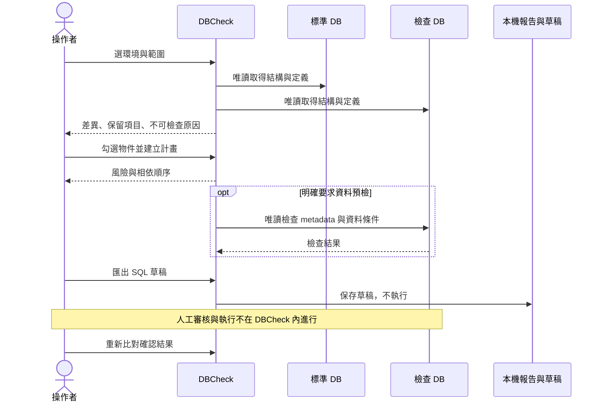

# 操作手順

## 先看介面，不連資料庫

```powershell
dotnet run -- --demo
```

示範模式使用合成物件；左邊的步驟 01～04 是結構工作流程，下面的資料工具與歷史頁是獨立入口。

## A. 一個標準 DB，檢查一個目標

1. 在「01 環境與基準」填寫兩邊伺服器／資料庫。選 Windows 驗證，或輸入 SQL 帳密。也可用「貼入連線」載入完整連線字串；輸入內容遮罩。
2. 分別按「測試連線」。測試包含資料庫 `VIEW DEFINITION` 權限；更改設定後舊驗證失效。
3. 在「02 比對範圍」選擇物件種類。外鍵或 CHECK 需同時選資料表。預設不比對定序、欄位順序、索引／約束名稱；需要嚴格檢查時取消相應忽略選項。
4. 按「開始唯讀比對」，等候「03 差異檢視」顯示結果。先確認是完整或部分完成，再處理差異。
5. 搜尋物件名稱或 schema。點一列看內容；勾選核取方塊表示把該物件加入計畫。**目前點選的列不等於已勾選的集合。**
6. 使用左右／合併檢視閱讀。小視窗建議手動改成合併檢視；F7 到下一處、Shift+F7 到上一處，雙擊相同區塊展開。
7. 檢閱「結構化差異」「原始定義」「範圍／失敗原因」分頁。目標額外物件標記保留，不可勾選刪除。
8. 按「建立變更計畫」。有阻擋項目時先查看原因，回差異頁取消不適用項目或補齊比對范围，再重建計畫。
9. 必要時按「唯讀資料預檢」。這會確認目標 metadata 是否改變，並可能掃描資料。只在有權限、可接受負載的目標上使用。
10. 匯出 SQL 草稿，在獲准測試環境確認、備份及審核後，由操作者在工具外執行。工具不執行任何修改。
11. 回到差異頁按 F5 重新比對。既有草稿不會因畫面顯示就被自動執行或保證仍然有效。



## B. 同一標準，批次檢查多個環境

先測試標準 DB。設定第一個檢查 DB、測試成功後按「加入已驗證目標」，再切換第二個檢查 DB 重複操作。

批次清單有內容時使用清單，沒有內容才使用目前檢查 DB。只變更上方檢查設定不會偷偷改寫已加入的目標連線；要替換同名目標應先移除再加入。連線及帳密只在本次程式記憶體內保留。

開始比對後，標準讀取一次，目標逐一處理，不同目標的錯誤分開記錄。結果頁上方選擇目標，下面顯示該目標的差異。失敗或部分完成可用「重試失敗」再次讀取；取消後尚未完成的目標不視為一致。

**資料工具不使用這個批次清單。** 它只使用步驟 01 上方兩組即時連線，避免資料修正意外套用多個環境。

## C. 匯出設定資料，不要求結構有差異

進入「資料匯出與補齊」，按「載入／更新資料表」。搜尋資料表後，選擇輸出欄位、可靠的主鍵／唯一索引、順逆排、筆數及選擇性條件。

鍵欄位會自動加入輸出。沒有主鍵但有可用唯一索引時可以使用；沒有任何可靠唯一鍵時停止，不自行推測哪幾欄代表業務身分。

按「匯出來源資料」，檢閱 SQL 草稿後複製或另存。這個功能只取來源資料，不查目標是否已有相同鍵。匯出腳本使用目標占位防護，必須先人工確認目標伺服器／資料庫，不能直接當成補缺腳本。

## D. 只補缺少資料，另外審閱內容差異

兩側即時連線測試成功後，在資料工具選表與範圍，按「比對並產生補缺 SQL」。

結果分成「目標缺少」「內容不同」「相同」。來源只取指定條件與排序的前 N 筆；目標按這批鍵值查詢，不掃描／刪除目標額外資料。

預設只補缺少資料。「另外產生 UPDATE」預設關閉；只有明確勾選才產生 UPDATE，並加入原選取欄位值的樂觀並發條件。執行時發現資料已異動就報錯並 rollback，不會盲目覆寫。

補缺 INSERT 若執行時發現同鍵已存在，會保留該筆，但不代表內容已一致。UPDATE 草稿不能不經重新比對就反覆重試。執行後仍應再次驗證。

小視窗可按「收合設定」放大結果區；較窄工具列中的操作位於更多選項內。產出的資料 SQL 可能含敏感內容，請妥善保管。

## E. 快照與離線比對

完成比對後，在「報告／快照」選單保存標準或檢查快照。快照沒有帳密或資料列，但包含物件定義。

「01 環境與基準」可以載入標準快照，系統會套用它的採集範圍。「歷史與操作手順」可以選兩份快照進行完全離線比對。採集範圍／排除規則不相容時不推論缺少物件。

離線結果不能執行資料預檢。快照過期、來源不可信或結構有變更時應重新採集。

## F. 交接報告與歷史

匯出 HTML 適合閱讀；JSON 適合程式處理；CSV 適合整理差異。三種格式都包含範圍或完成狀態資訊；CSV 第一個資料列是 Metadata。

自動歷史只保存摘要與待處理物件識別。相同標準／目標、相同規則且兩次完整時才計算新增與已解決數量；部分完成不會被誤認成大量問題已消失。

## 操作前確認

確認標準與檢查方向、範圍、排除規則、目標名稱及比對時間。比對期間避免 DDL 變更。產生 SQL 不等於 SQL 已通過真實資料驗證；帶有「待確認」的計畫仍需人工審核。
